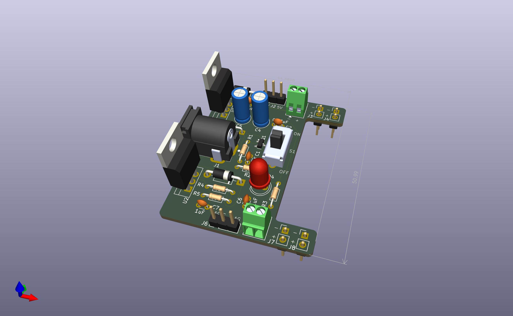

# Breadboard Power Supply (Through-Hole Edition)

A simple and solder-friendly breadboard power supply designed in KiCad. This board takes a 9 V input from a barrel jack and provides a regulated 5 V or 3.3 V output through jumper-selectable headers and screw terminals. It is built entirely with through-hole components so it is easy to assemble, troubleshoot, and practice soldering on a real PCB.

This project is part of my ongoing work to learn KiCad, electronics fundamentals, and the full workflow of designing and building PCBs from scratch. It serves as my starting point for future hardware projects that will build on these skills.

---

## Features

* 9 V input via DC barrel jack
* On-board power switch and P-channel MOSFET high-side gating
* Linear regulation using the LM7805 and LM317
* Jumper selection for 5 V or 3.3 V output
* Output available on both breadboard header pins and screw terminals
* Supports 500 mA continuous current (thermal limits of linear regulators apply)
* Designed entirely with through-hole components for easy assembly
* Clear schematic and board layout suitable for beginners learning KiCad and basic EE

---

## Project Motivation

I created this board to build confidence in schematic capture, PCB layout, and hardware design decisions. My short-term goal is to design functional and realistic boards, and my long-term goal is to develop repeatable workflows that will let me design my own hardware products.

This first version uses through-hole components to make soldering and prototyping accessible. A future branch of this project will use only SMD components for a smaller footprint and a more polished power supply module for personal use in upcoming electronics projects.

---

## Repository Contents

* Full KiCad project files
* PDF schematic
* PDF board layout sheet
* 3D through-hole model render
* Notes and revision history for future SMD version

---

## Schematic

[Schematic PDF](ReadmeResources/BreadBoardPowerSupplySchematic.pdf)

---

## PCB Layout

[PCB Layout PDF](ReadmeResources/BreadBoardPowerSupplyThroghHolePCB.pdf)

---

## 3D Model (Through-Hole Build)

---

## Output Options

The board includes:

* Jumper-selectable 5 V or 3.3 V supply
* Breadboard header pins for fast prototyping
* Screw terminals for powering external circuits
* Status LED indicators for each rail
* Filtering capacitors for stable linear regulation
* Reverse-current protection on each regulated output

In the schematic, each regulator block is shown with its filtering capacitors, protection diodes, jumper header wiring, and LED indicators.

---

## Future Plans

This project will continue to evolve as I learn:

* SMD-only redesign for a more compact footprint
* Improved layout and routing strategies
* Switching regulator upgrades to increase efficiency
* Higher current output and thermal improvements
* Custom enclosures and accessory boards for personal projects
